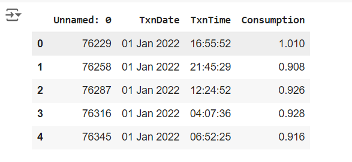

# Ex.No: 01A PLOT A TIME SERIES DATA
###  Date: 

# AIM:
To Develop a python program to Plot a time series data of power consumption.
# ALGORITHM:
1. Import the required packages like pandas and matplot
2. Read the dataset using the pandas
3. Calculate the mean for the respective column.
4. Plot the data according to need and can be altered monthly, or yearly.
5. Display the graph.
# PROGRAM:
```
import pandas as pd
import matplotlib.pyplot as plt
data = pd.read_csv("/content/KwhConsumptionBlower78_1.csv")
data.head()
data['TxnDate']=pd.to_datetime(data['TxnDate'])
data.set_index('TxnDate',inplace=True)
plt.plot(data.index,data['Consumption'],label='Consumption')
plt.title("Daily Power Consumption")
plt.xlabel("TxnDate")
plt.xticks(rotation=45)
plt.ylabel("Consumption")
plt.grid(True)
plt.legend()
plt.show()
```

# Dataset:


# OUTPUT:


# RESULT:
Thus we have created the python code for plotting the time series of given dataset.
